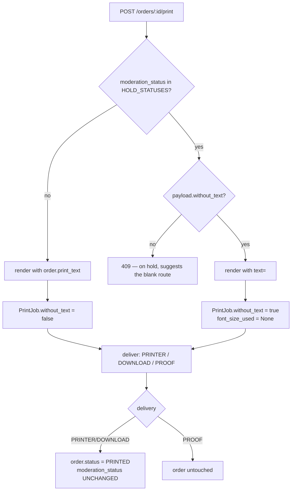

# LLD — printing a held order without its text

An order held by the moderation gate cannot be printed at all today, including
as a proof. This adds one route through the hold: print the artwork with no
text on it.

HLD skipped — no new component. One request flag, one audit column, one
conditional in an existing endpoint.

## 1. Why this is not a bypass

The hold exists so that unreviewed text never lands on brand artwork. Printing
without the text satisfies that requirement completely: the held string is
dropped before the renderer sees it, so nothing an admin has not approved
reaches the label. The gate is not weakened — the order simply takes a route
that has no text in it.

The hold itself survives the print. An order can be `PRINTED` while its
`moderation_status` is still `FLAGGED`, and the job records which of the two
actually happened.

## 2. Flow



## 3. The single point of omission

```python
text="" if payload.without_text else order.print_text
```

`render_order` is the only producer of the TIFF, PDF and preview, and CUPS is
fed from its output. There is no second path the text could leak through — a
property worth preserving if the render pipeline is ever split.

`render_order("")` is already safe: `fit_text` returns immediately (`total = 0
<= h`, no shrink loop), the draw loop iterates zero lines, and
`erase_placeholder` still wipes the baked-in mock-up text so the label comes
out genuinely blank rather than showing `XXXXXXXX`.

## 4. Data model

| Field | Type | Nullable | Default | Notes |
| --- | --- | --- | --- | --- |
| `print_jobs.without_text` | `BOOLEAN` | no | `false` | This job printed blank. |

Additive migration, `ADD COLUMN IF NOT EXISTS ... NOT NULL DEFAULT false` —
safe on a populated table, and correct for history: every job that already
exists did print its text.

`font_size_used` is set to `NULL` for a blank job. `fit_text` returns the
starting size unchanged for empty text, which would otherwise record a
confident type size against a label with no type on it.

## 5. API contract

`POST /orders/{id}/print` gains one optional field:

```json
{ "without_text": false }
```

- Accepted on **any** order, not only held ones. A blank label is never the
  unsafe outcome, so rejecting it elsewhere would be noise. The held-only
  restriction is a UI affordance, not an API rule.
- Authorization is unchanged: `_load_order` applies store scoping, so an
  operator can only do this to their own store's orders. Blank printing is
  **not** a way around scoping.
- No new role. Any operator can use it — requiring an admin would leave the
  store blocked, which is the problem this solves.

409 on a held order now names the alternative rather than being a dead end.

## 6. UI

The hold banner in `PrintDialog` gains the action. The four normal print
buttons stay disabled while held (`printLocked`), so the only live control on a
held order is the blank route plus the admin review controls.

Job history marks blank jobs with a `no text` tag — an order reading `PRINTED`
with `FLAGGED` text is otherwise ambiguous about what went out.

## 7. Security

| Check | Finding |
|---|---|
| Held text reaching artwork | **Prevented.** Pinned by `test_printing_without_text_never_sends_the_text_to_the_renderer`, which spies on the render call and asserts both `text == ""` and that the flagged string appears nowhere in the kwargs. |
| Normal path still blocked | **Yes.** Plain print, explicit `without_text: false`, and PROOF all still 409 on a held order. |
| Store scoping | **Unchanged.** Pinned by test — another store's held order 404s. |
| Privilege | No new capability. Printing blank artwork was already possible for any order whose text happened to be empty. |
| Audit | Improved: previously nothing recorded whether a label carried its text. |

## 8. Open items

1. `REJECTED` orders can be blank-printed. Agreed deliberately: the refusal
   applies to the text, and a blank label contains none of it. If the intent
   was ever "this order must never reach paper at all", that needs a separate
   order-level state, not a moderation status.
2. No bulk action — a store with 50 held orders clicks 50 times.
