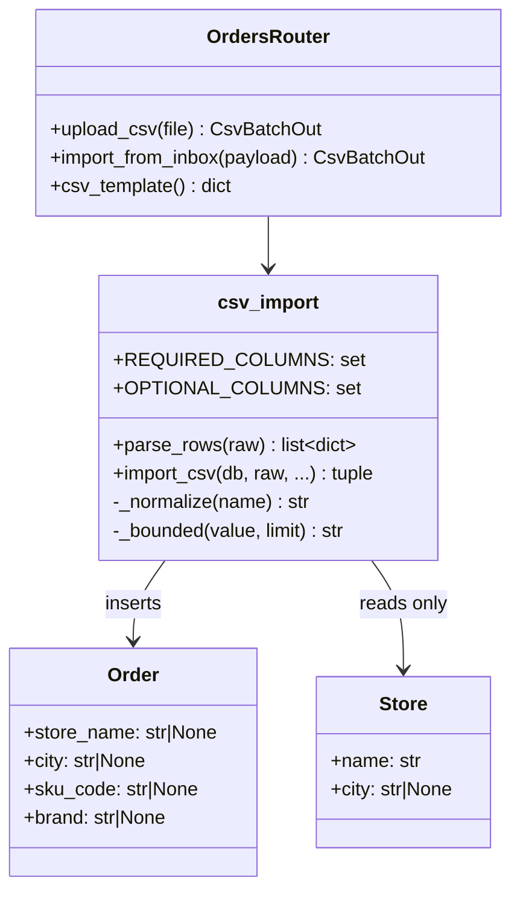
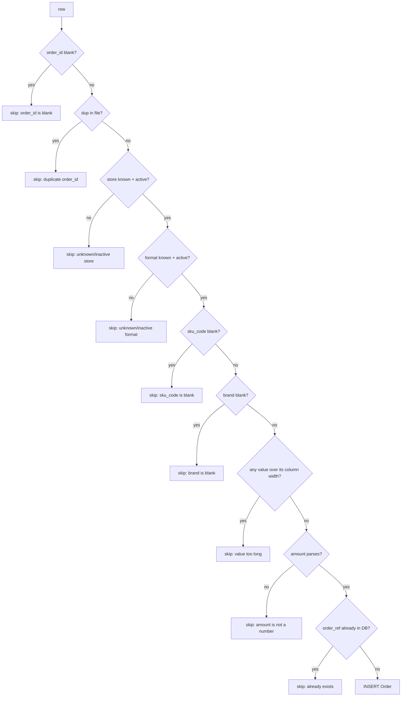

# LLD — CSV intake: order enrichment fields

Adds `store_name`, `city`, `sku_code` and `brand` to the order CSV intake
contract, and demotes `amount` from required to optional.

HLD skipped by agreement: this introduces no new component, service or
integration — it widens one existing parser and one existing table.

## 1. Scope

| In | Out |
|---|---|
| CSV contract + parser (`services/csv_import.py`) | Searching the queue by `sku_code` / `brand` |
| 4 new `orders` columns + additive migration | Any index on the new columns |
| `OrderOut` payload, `/csv/template` | Backfill of historical orders |
| Sample CSV, seed script, README contract table | Any change to rendering or printing |

## 2. Module breakdown



**`csv_import`** — sole owner of the contract. `REQUIRED_COLUMNS` gates the
header; `OPTIONAL_COLUMNS` is accepted-if-present. Error modes: `CsvFormatError`
(whole file, → 422) vs. a row appended to `ImportResult.errors` (that row only).

**`Store`** is read-only from this path. The importer resolves `store_id` →
`Store` for routing and never writes to the table. This is the load-bearing
decision behind the snapshot columns.

## 3. Data model

New columns on `orders`, all nullable so the migration stays additive:

| Field | Type | Nullable | Default | Notes |
| --- | --- | --- | --- | --- |
| `store_name` | `VARCHAR(255)` | yes | — | Snapshot of the upstream store name. Matches `stores.name` width. |
| `city` | `VARCHAR(128)` | yes | — | Snapshot. Matches `stores.city` width. |
| `sku_code` | `VARCHAR(64)` | yes | — | Required in the CSV; nullable in the DB so pre-existing rows survive. |
| `brand` | `VARCHAR(128)` | yes | — | Same. |

`orders.amount` is unchanged — `NUMERIC(12,2) NOT NULL DEFAULT 0`. Rows imported
without the column land on `0`.

### Why nullable when two of them are required

The CSV requires `sku_code` and `brand`; the column does not. Orders that
predate this change have no value and never will, and a `NOT NULL` column would
need a backfill with invented data to be added at all. The invariant is enforced
at the boundary that can actually see the truth — the parser — not by a
constraint that would have to lie about history.

**Indexes** — none added. No query filters or sorts on the new columns; the
queue's `q` filter still searches `order_ref` and `print_text` only. An index
here would be write cost with no reader.

**Migrations** (`app/migrations.py`, runs on every startup)

- Forward: 4 × `ALTER TABLE orders ADD COLUMN IF NOT EXISTS …`. Idempotent,
  non-blocking — Postgres adds a nullable column without a table rewrite.
- Backward: revert the code. The columns are nullable and unread by the previous
  version, so a rollback leaves them in place, inert. No data is lost either way.

## 4. API contracts

### `POST /csv/upload` · `POST /csv/import-from-inbox`

Auth: Bearer JWT, `ADMIN` only. Unchanged.

Accepted header — required:

```
order_id, store_id, sku_code, brand, print_format, text
```

Optional, honoured when present: `store_name`, `city`, `amount`.

Aliases (case / space / punctuation insensitive):

| Canonical | Accepted as |
| --- | --- |
| `sku_code` | `sku`, `skucode`, `skuid`, `itemcode`, `materialcode` |
| `brand` | `brandname` |
| `store_name` | `storename`, `outlet`, `outletname` |
| `city` | `town`, `storecity`, `location` |

Responses:

- `201` → `CsvBatchOut`. Rows that fail validation are reported in `errors[]`,
  never raised — the batch always imports what it can.
- `422` → `{"detail": "CSV is missing required column(s): brand, sku_code. …"}`

### `GET /csv/template`

Returns `columns` (required, then optional, in contract order) and a worked
`example` carrying every column. Pinned to the parser by test.

### `GET /orders`, `GET /orders/{id}`

`OrderOut` gains `store_name`, `city`, `sku_code`, `brand` — all `str | None`.
Additive; existing clients ignore unknown keys.

## 5. Row validation flow



Length limits are read off the `orders` columns at import time
(`Order.__table__.c[...].type.length`) rather than restated in the parser, so
widening a column cannot leave a stricter limit behind.

Length checks run **before** the insert, not at COMMIT. `import_csv` commits
once for the whole batch, so a value wider than its column would raise
`DataError` at COMMIT and roll back every row that had already validated — one
bad cell silently destroying a good import. Checking in the loop turns that into
one skipped row with a reason.

Idempotency is by `order_ref`: unique constraint `uq_orders_order_ref`, plus a
pre-insert existence check and an in-file `seen` set, so re-uploading the same
file is a no-op that reports "already exists" per row.

## 6. Observability

Unchanged by this work, and thin: the importer's per-row outcomes are persisted
on `csv_batches` (`total_rows`, `imported`, `skipped`, `errors` JSONB, capped at
200 entries) and surfaced in the admin UI. There is no structured logger, metric
or trace on this path today, and this change does not add one — see Open items.

## 7. Error model

| Reason string | Scope | HTTP | Retryable |
| --- | --- | --- | --- |
| `CSV is missing required column(s): …` | whole file | 422 | No — fix the header |
| `order_id is blank` | row | 201 | No |
| `duplicate order_id within this file` | row | 201 | No |
| `unknown store code 'X'` / `store 'X' is inactive` | row | 201 | After store setup |
| `unknown print format 'X'` / `… is inactive` | row | 201 | After format setup |
| `sku_code is blank` / `brand is blank` | row | 201 | No |
| `<field> is too long (N > M characters)` | row | 201 | No |
| `amount 'X' is not a number` | row | 201 | No |
| `order_id already exists in the system` | row | 201 | No — idempotent |

## 8. Security

- **Authz** unchanged: both intake endpoints are `AdminUser`. Operators cannot
  reach them, and store scoping on `GET /orders` is untouched.
- **Validation at the boundary.** All four new fields are length-bounded in the
  parser against their column widths. Values are bound as SQLAlchemy parameters,
  never interpolated — no injection surface.
- **No privilege escalation through data.** The snapshot decision means an
  uploaded file cannot rename a store, move an order to another store, or create
  master data. The CSV's `store_name` / `city` are inert strings.
- **PII:** `store_name` and `city` are business-location data, not personal.
  `sku_code` and `brand` are product data. No new PII is introduced; the
  pre-existing `print_text` remains the only field that may carry a customer
  name, and this change does not touch its handling.

## 9. Performance

- **No new queries.** `import_csv` already preloads all stores and formats into
  dicts before the row loop; the four new fields are scalars on an existing
  INSERT. Row cost is unchanged.
- **Pre-existing N+1 left in place:** the loop issues one
  `SELECT orders.id WHERE order_ref = ?` per row for the existence check. At
  realistic batch sizes (the sample file is 8 rows, production files are in the
  hundreds) this is not worth restructuring inside this change — noted as an
  open item rather than fixed silently.
- Length checks are `len()` on short strings — immeasurable next to the I/O.

## 10. Open items

1. `sku_code` / `brand` are not searchable from the queue. Deliberately out of
   scope; likely the next request once operators see the fields.
2. The per-row existence `SELECT` should become one batched `IN` query against
   the file's order refs.
3. No structured logging or metrics on the import path. Pre-existing.
4. `orders.amount` is now fed by nothing. If it is genuinely dead, a later
   change should drop the column and the `amount_pending` stat rather than
   leave a field that always reads zero.
